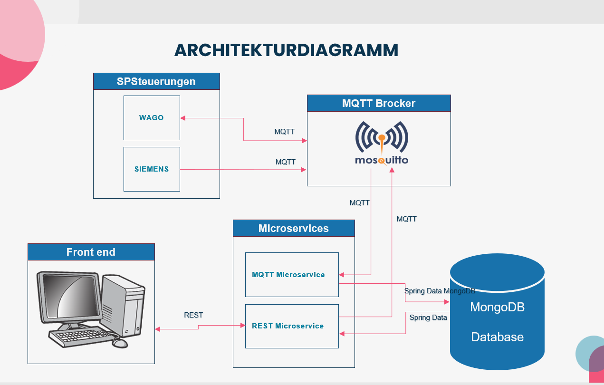
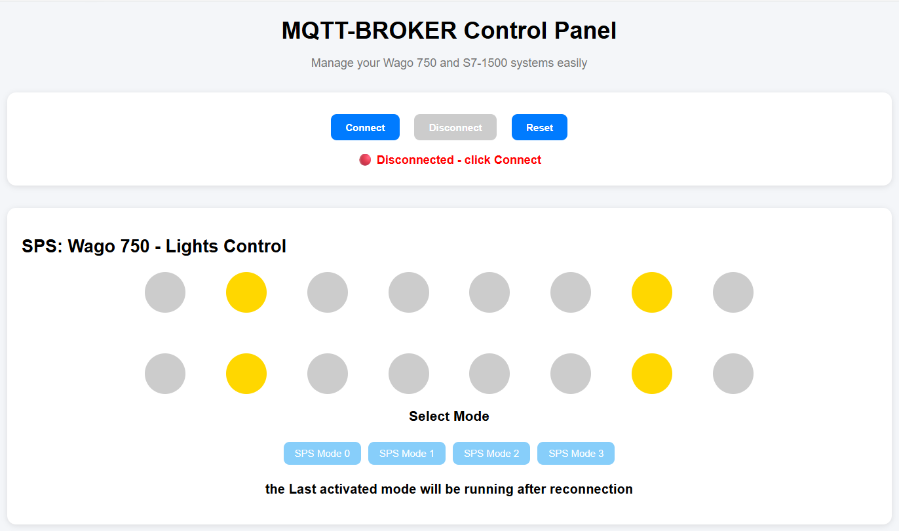
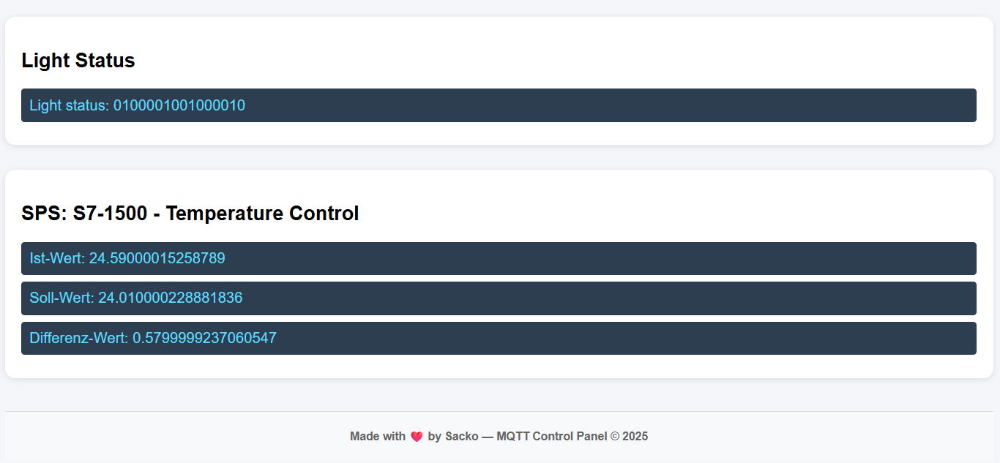
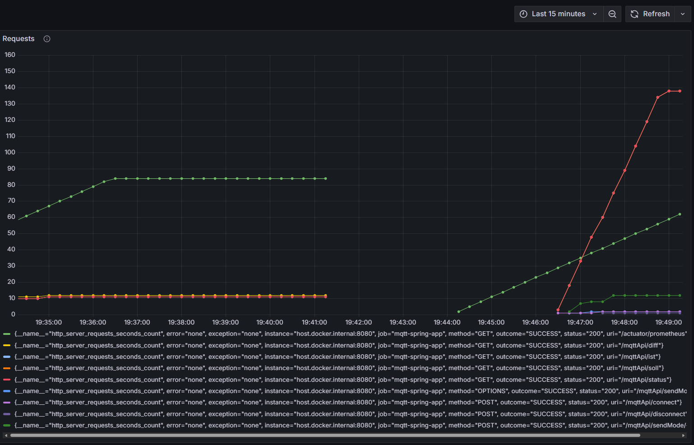

# Industrial IoT Monitoring and Control Platform using MQTT, Spring Boot, Angular and MongoDB

An Industrial Internet of Things (IIoT) project for real-time monitoring and control of SPS/PLC devices using MQTT communication, Spring Boot microservices, Angular frontend, and MongoDB.

The system connects to online industrial controllers (SPS/PLC) and allows:

- real-time monitoring of industrial data
- lamp status visualization
- temperature monitoring
- remote control of SPS operating modes
- MQTT communication with industrial devices
- persistent storage using MongoDB

The project combines IoT, industrial automation, microservices, REST APIs, and modern frontend technologies.

---

# Project Overview

The platform communicates with industrial PLC systems through an MQTT broker.

The architecture contains:

- SPS/PLC devices (WAGO and Siemens)
- MQTT Broker (Mosquitto)
- Spring Boot Microservices
- Angular Frontend
- MongoDB Database

The system receives industrial data in real time and allows users to remotely control the SPS state through the frontend interface.

The project implements:

- MQTT communication
- REST communication
- real-time data processing
- industrial monitoring
- remote control
- MongoDB persistence

---

# Architecture Diagram



The architecture includes:

- WAGO SPS for lamp control
- Siemens SPS for temperature values
- Mosquitto MQTT Broker
- Spring Boot backend microservices
- Angular frontend
- MongoDB database

---

# Features

## MQTT Communication

- MQTT client connection
- topic subscription
- message publishing
- automatic reconnection
- topic-based message routing

Implemented using Eclipse Paho MQTT. 

---

## SPS/PLC Monitoring

The platform monitors:

### WAGO SPS

- lamp status
- binary lamp visualization
- operating modes

### Siemens SPS

- actual temperature
- target temperature
- temperature difference

MQTT topics include:

```text
Wago750/Status
Wago750/Control
S7_1500/Temperatur/Ist
S7_1500/Temperatur/Soll
S7_1500/Temperatur/Differenz
```
---

## Real-Time Lamp Visualization

The frontend displays:

- 16-bit binary lamp states
- active/inactive lamp visualization
- live updates from MQTT topics

The binary conversion is implemented in the backend service:

```java
String binary = String.format("%16s",
Integer.toBinaryString(statusValue)).replace(" ", "0");
```
---

## REST API

The backend exposes REST endpoints for:

- MQTT connection
- MQTT disconnection
- mode switching
- temperature retrieval
- lamp status retrieval
- message history retrieval

Example endpoints:

```text
POST /mqttApi/connect
POST /mqttApi/disconnect
POST /mqttApi/sendMode/{mode}
GET  /mqttApi/status
GET  /mqttApi/ist
GET  /mqttApi/soll
GET  /mqttApi/diff
```
---

## MongoDB Persistence

The platform stores:

- lamp status messages
- temperature messages
- timestamps
- MQTT topic history

MongoDB entities include:

- MessageDocument
- LampMessageDocument
- TemperatureMessageDocument

---

# MQTT Service Workflow

The MQTT service handles:

- broker connection
- topic subscription
- message reception
- message publishing
- automatic reconnection
- persistence in MongoDB

Implemented in:

```text
MqttListener.java
```
---

# Backend Components

## Main Components

### MQTT Configuration

Creates and configures the MQTT client. 

### MQTT Listener

Handles:

- MQTT callbacks
- subscriptions
- message processing
- reconnection
- publishing

### REST Controller

Provides REST endpoints for frontend communication. 

### Mongo Repository

Stores MQTT messages in MongoDB. 

---

# Frontend Interface

The Angular frontend provides:

- connect/disconnect controls
- live SPS monitoring
- lamp visualization
- mode switching
- temperature display

The frontend communicates with the backend using REST APIs.




---

# Concepts Explored

- Industrial IoT (IIoT)
- MQTT Communication
- SPS/PLC Communication
- Microservices
- REST APIs
- Real-Time Monitoring
- Industrial Automation
- MongoDB Persistence
- Angular Frontend Development

---

# Technologies Used

## Backend

- The backend is implemented using:

- Java
- Spring Boot
- Spring Data MongoDB
- Eclipse Paho MQTT
- REST APIs
- Lombok
- MongoDB
- Maven

## Frontend

- Angular
- TypeScript
- HTML
- CSS

---

# Monitoring, Logging and Testing

The project also integrates monitoring, logging, and testing tools commonly used in industrial and production-ready systems.

---

# Application Logging

The backend uses:

- Spring Boot Logging
- Logback

A custom `logback-spring.xml` configuration is used to generate application logs inside:

```text
logs/mqtt.log
```

The logging system records:

- MQTT connections
- subscriptions
- published messages
- received SPS messages
- warnings and errors
- reconnection attempts

The logging levels are configured inside:

```text
application.properties
```

Example log levels:

```properties
logging.level.root=ERROR
logging.level.bo.ms.informatik.mqttproject=INFO
```

This allows the application to reduce unnecessary framework logs while keeping important project-specific monitoring information.

---

# Monitoring with Prometheus and Grafana

The project integrates:

- Spring Boot Actuator
- Prometheus
- Grafana
- Docker

for real-time monitoring and visualization of application metrics.

---

## Prometheus Integration

Spring Boot metrics are exposed through:

```text
/actuator/prometheus(http://localhost:8080/actuator/prometheus)
```

Prometheus periodically scrapes metrics from the backend application.

Example metrics include:

- JVM memory usage
- HTTP request metrics
- CPU usage
- active connections
- application health metrics

Prometheus is configured using:

```yaml
prometheus.yml
```

and runs inside a Docker container.

---

## Grafana Dashboard

Grafana is connected to Prometheus in order to visualize metrics through dashboards.

The monitoring dashboard allows visualization of:

- HTTP request statistics
- application performance
- REST endpoint activity
- JVM metrics
- runtime monitoring
- backend communication flow

### Example Monitoring Dashboard



The dashboard above visualizes real-time HTTP request metrics collected from the Spring Boot MQTT application through Prometheus and displayed in Grafana.

The graph monitors different REST endpoints such as:

```text
/mqttApi/status
/mqttApi/diff
/mqttApi/ist
/mqttApi/soll
/mqttApi/connect
/mqttApi/disconnect
/mqttApi/sendMode
```

This allows real-time observation of backend activity and endpoint usage frequency.

Grafana is deployed using Docker and accessible through:

```text
http://localhost:3000
```

---

# Testing and Code Coverage

The project also includes automated testing and test coverage analysis.

Testing tools include:

- JUnit
- Spring Boot Test
- Mockito
- JaCoCo

---

## JaCoCo Integration

JaCoCo is integrated through Maven to generate code coverage reports.

The coverage report is generated using:

```bash
mvn clean verify
```

Generated reports are available inside:

```text
target/site/jacoco/index.html
```

The reports provide:

- line coverage
- method coverage
- class coverage
- execution statistics

This helps evaluate the reliability and test quality of the backend services.

---

# DevOps and Infrastructure Concepts

The project also explores:

- Docker containerization
- application observability
- metrics collection
- monitoring dashboards
- industrial system logging
- backend testing workflows
- code coverage analysis


# Notes

- The project communicates with real industrial SPS/PLC systems.
- MQTT communication is implemented using the Mosquitto broker.
- The system supports automatic reconnection after MQTT connection loss.
- Industrial data is stored persistently in MongoDB.
- The frontend provides real-time visualization of SPS states.

---

# Author

Kalil Sacko

Master Student in Computer Science  
Hochschule Bochum
